# Diagrama de classes UML

```mermaid
classDiagram
    direction LR

    class Serializable {
        <<interface>>
    }

    class Exception {
        <<external>>
    }

    class Identificavel {
        <<interface>>
        +getId() String
    }

    class PessoaObservadora {
        <<abstract>>
        -String id
        -String nome
        -String email
        -LocalDate dataCadastro
        #PessoaObservadora(String nome, String email)
        +getTipo()* String
        +getVinculo()* String
        +getId() String
        +setId(String id) void
        +getNome() String
        +setNome(String nome) void
        +getEmail() String
        +setEmail(String email) void
        +getDataCadastro() LocalDate
        +setDataCadastro(LocalDate dataCadastro) void
        +toString() String
    }

    class AstronomoAmador {
        -NivelExperiencia nivelExperiencia
        -String clubeAstronomia
        +AstronomoAmador(String nome, String email, NivelExperiencia nivelExperiencia, String clubeAstronomia)
        +getNivelExperiencia() NivelExperiencia
        +setNivelExperiencia(NivelExperiencia nivelExperiencia) void
        +getClubeAstronomia() String
        +setClubeAstronomia(String clubeAstronomia) void
        +getTipo() String
        +getVinculo() String
    }

    class Pesquisador {
        -String instituicao
        -String areaPesquisa
        +Pesquisador(String nome, String email, String instituicao, String areaPesquisa)
        +getInstituicao() String
        +setInstituicao(String instituicao) void
        +getAreaPesquisa() String
        +setAreaPesquisa(String areaPesquisa) void
        +getTipo() String
        +getVinculo() String
    }

    class Telescopio {
        -String id
        -String nome
        -TipoTelescopio tipo
        -double aberturaMilimetros
        -boolean ativo
        +Telescopio(String nome, TipoTelescopio tipo, double aberturaMilimetros)
        +getId() String
        +setId(String id) void
        +getNome() String
        +setNome(String nome) void
        +getTipo() TipoTelescopio
        +setTipo(TipoTelescopio tipo) void
        +getAberturaMilimetros() double
        +setAberturaMilimetros(double aberturaMilimetros) void
        +isAtivo() boolean
        +setAtivo(boolean ativo) void
        +toString() String
    }

    class SessaoObservacao {
        -DateTimeFormatter FORMATO_DATA
        -String id
        -PessoaObservadora observador
        -Telescopio telescopio
        -String alvoCeleste
        -LocalDateTime inicio
        -int duracaoMinutos
        -StatusSessao status
        -Integer qualidadeCeu
        -String anotacoes
        +SessaoObservacao(PessoaObservadora observador, Telescopio telescopio, String alvoCeleste, LocalDateTime inicio, int duracaoMinutos)
        +getId() String
        +setId(String id) void
        +getObservador() PessoaObservadora
        +setObservador(PessoaObservadora observador) void
        +getTelescopio() Telescopio
        +setTelescopio(Telescopio telescopio) void
        +getAlvoCeleste() String
        +setAlvoCeleste(String alvoCeleste) void
        +getInicio() LocalDateTime
        +setInicio(LocalDateTime inicio) void
        +getDuracaoMinutos() int
        +setDuracaoMinutos(int duracaoMinutos) void
        +getStatus() StatusSessao
        +setStatus(StatusSessao status) void
        +getQualidadeCeu() Integer
        +setQualidadeCeu(Integer qualidadeCeu) void
        +getAnotacoes() String
        +setAnotacoes(String anotacoes) void
        +getFim() LocalDateTime
        +toString() String
    }

    class NivelExperiencia {
        <<enumeration>>
        INICIANTE
        INTERMEDIARIO
        AVANCADO
        -String descricao
        +getDescricao() String
    }

    class TipoTelescopio {
        <<enumeration>>
        REFLETOR
        REFRATOR
        CATADIOPTRICO
        RADIO
        -String descricao
        +getDescricao() String
    }

    class StatusSessao {
        <<enumeration>>
        AGENDADA
        CONCLUIDA
        CANCELADA
        -String descricao
        +getDescricao() String
    }

    class Repositorio~T~ {
        <<interface>>
        +inserir(T entidade) void
        +atualizar(T entidade) void
        +buscarPorId(String id) T
        +listar() List~T~
    }

    class RepositorioArquivo~T~ {
        -Path arquivo
        -Class~T~ tipoEntidade
        +RepositorioArquivo(Path diretorio, String nomeArquivo, Class~T~ tipoEntidade)
        +inserir(T entidade) void
        +atualizar(T entidade) void
        +buscarPorId(String id) T
        +listar() List~T~
        -carregar() List~T~
        -salvar(List~T~ entidades) void
        -moverTemporario(Path temporario) void
    }

    class CadastroObservador {
        -Repositorio~PessoaObservadora~ repositorio
        +CadastroObservador(Repositorio~PessoaObservadora~ repositorio)
        +cadastrar(PessoaObservadora observador) PessoaObservadora
        +buscarPorId(String id) PessoaObservadora
        +listar() List~PessoaObservadora~
        -validarDadosEspecificos(PessoaObservadora observador) void
    }

    class CadastroTelescopio {
        -Repositorio~Telescopio~ repositorio
        +CadastroTelescopio(Repositorio~Telescopio~ repositorio)
        +cadastrar(Telescopio telescopio) Telescopio
        +buscarPorId(String id) Telescopio
        +listar() List~Telescopio~
    }

    class GestaoSessao {
        -Repositorio~SessaoObservacao~ repositorio
        -CadastroObservador cadastroObservador
        -CadastroTelescopio cadastroTelescopio
        -Clock relogio
        +GestaoSessao(Repositorio~SessaoObservacao~ repositorio, CadastroObservador cadastroObservador, CadastroTelescopio cadastroTelescopio)
        +GestaoSessao(Repositorio~SessaoObservacao~ repositorio, CadastroObservador cadastroObservador, CadastroTelescopio cadastroTelescopio, Clock relogio)
        +agendar(String observadorId, String telescopioId, String alvoCeleste, LocalDateTime inicio, int duracaoMinutos) SessaoObservacao
        +concluir(String sessaoId, int qualidadeCeu, String anotacoes) SessaoObservacao
        +cancelar(String sessaoId) SessaoObservacao
        +listar() List~SessaoObservacao~
        -buscarSessaoAgendada(String sessaoId) SessaoObservacao
        -validarConflitos(SessaoObservacao novaSessao) void
    }

    class Validador {
        -Pattern EMAIL
        -Validador()
        ~textoObrigatorio(String valor, String campo) String
        ~email(String valor) String
    }

    class OperacoesObservatorio {
        <<interface>>
        +cadastrarObservador(PessoaObservadora observador) PessoaObservadora
        +cadastrarTelescopio(Telescopio telescopio) Telescopio
        +agendarSessao(String observadorId, String telescopioId, String alvoCeleste, LocalDateTime inicio, int duracaoMinutos) SessaoObservacao
        +concluirSessao(String sessaoId, int qualidadeCeu, String anotacoes) SessaoObservacao
        +cancelarSessao(String sessaoId) SessaoObservacao
        +listarObservadores() List~PessoaObservadora~
        +listarTelescopios() List~Telescopio~
        +listarSessoes() List~SessaoObservacao~
    }

    class FachadaObservatorio {
        -CadastroObservador cadastroObservador
        -CadastroTelescopio cadastroTelescopio
        -GestaoSessao gestaoSessao
        +FachadaObservatorio()
        +FachadaObservatorio(Path diretorioDados)
        +FachadaObservatorio(Path diretorioDados, Clock relogio)
        +cadastrarObservador(PessoaObservadora observador) PessoaObservadora
        +cadastrarTelescopio(Telescopio telescopio) Telescopio
        +agendarSessao(String observadorId, String telescopioId, String alvoCeleste, LocalDateTime inicio, int duracaoMinutos) SessaoObservacao
        +concluirSessao(String sessaoId, int qualidadeCeu, String anotacoes) SessaoObservacao
        +cancelarSessao(String sessaoId) SessaoObservacao
        +listarObservadores() List~PessoaObservadora~
        +listarTelescopios() List~Telescopio~
        +listarSessoes() List~SessaoObservacao~
    }

    class TelaPrincipal {
        -Scanner ENTRADA
        -OperacoesObservatorio FACHADA
        -DateTimeFormatter FORMATO_DATA_HORA
        -TelaPrincipal()
        +main(String[] args) void
        -configurarSaidaUtf8() void
        -exibirCabecalho() void
        -lerOpcaoMenu() int
        -executarOpcao(int opcao) void
        -cadastrarObservador() void
        -cadastrarTelescopio() void
        -agendarSessao() void
        -concluirSessao() void
        -cancelarSessao() void
        -lerTexto(String mensagem) String
        -lerInteiro(String mensagem) int
        -lerDecimal(String mensagem) double
        -lerDataHora(String mensagem) LocalDateTime
        -lerEnum(String titulo, E[] opcoes) E
        -obterRotuloEnum(Enum opcao) String
        -imprimirLista(String titulo, List registros) void
    }

    class RegraNegocioException {
        +RegraNegocioException(String mensagem)
    }

    class PersistenciaException {
        +PersistenciaException(String mensagem, Throwable causa)
    }

    Serializable <|-- Identificavel
    Identificavel <|.. PessoaObservadora
    Identificavel <|.. Telescopio
    Identificavel <|.. SessaoObservacao
    PessoaObservadora <|-- AstronomoAmador
    PessoaObservadora <|-- Pesquisador
    AstronomoAmador --> NivelExperiencia
    Telescopio --> TipoTelescopio
    SessaoObservacao --> StatusSessao
    SessaoObservacao --> PessoaObservadora
    SessaoObservacao --> Telescopio
    Repositorio <|.. RepositorioArquivo
    CadastroObservador --> Repositorio
    CadastroObservador ..> Validador
    CadastroTelescopio --> Repositorio
    CadastroTelescopio ..> Validador
    GestaoSessao --> Repositorio
    GestaoSessao --> CadastroObservador
    GestaoSessao --> CadastroTelescopio
    GestaoSessao ..> Validador
    OperacoesObservatorio <|.. FachadaObservatorio
    FachadaObservatorio --> CadastroObservador
    FachadaObservatorio --> CadastroTelescopio
    FachadaObservatorio --> GestaoSessao
    TelaPrincipal --> OperacoesObservatorio
    Exception <|-- RegraNegocioException
    Exception <|-- PersistenciaException
    CadastroObservador ..> RegraNegocioException
    CadastroTelescopio ..> RegraNegocioException
    GestaoSessao ..> RegraNegocioException
    RepositorioArquivo ..> PersistenciaException
```



## Fluxo entre camadas

```text
TelaPrincipal
      │ usa o contrato
      ▼
OperacoesObservatorio ← FachadaObservatorio
                             │ coordena
                             ▼
                 Cadastros / GestaoSessao
                             │ usa o contrato
                             ▼
                  Repositorio<T> ← RepositorioArquivo<T>
                                           │
                                           ▼
                                    arquivos .ser
```
