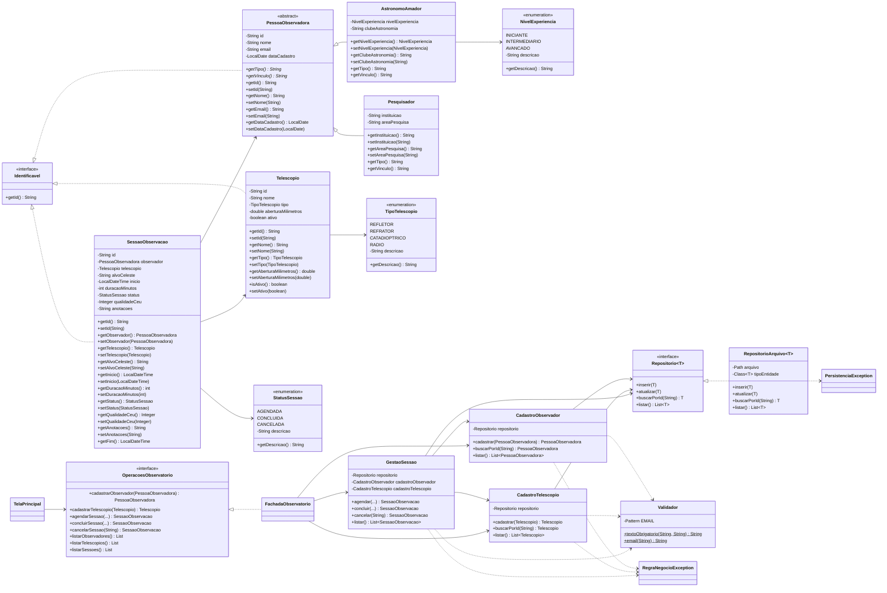

# Diagrama de classes UML

O diagrama abaixo usa Mermaid. Ele pode ser visualizado no GitHub, no GitLab ou em qualquer editor compatível com Mermaid.



## Fluxo entre camadas

```text
TelaPrincipal
      │ usa o contrato
      ▼
OperacoesObservatorio ← FachadaObservatorio
                             │ coordena
                             ▼
                 Cadastros / GestaoSessao
                             │ usa o contrato
                             ▼
                  Repositorio<T> ← RepositorioArquivo<T>
                                           │
                                           ▼
                                    arquivos .ser
```
